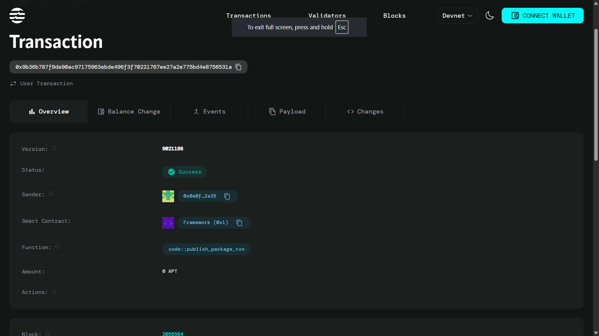

# Access Token System

## Project Description

The Access Token System is a Move smart contract built for the Aptos blockchain that implements temporary access tokens for secure operations. This system provides a mechanism to create time-limited, single-use tokens that can authorize specific operations, enhancing security by ensuring that access permissions are temporary and controlled.

## Project Vision

Our vision is to create a robust, decentralized access control system that provides:
- **Temporary Access Control**: Implement time-bound permissions that automatically expire
- **Operation-Specific Authorization**: Enable granular control over different types of operations
- **Enhanced Security**: Reduce security risks through single-use, expiring tokens
- **Decentralized Management**: Eliminate the need for centralized access control systems

## Key Features

### 🔐 Temporary Access Tokens
- Generate unique access tokens with customizable expiration times
- Automatic token expiration based on blockchain timestamps
- Single-use token mechanism for enhanced security

### 🎯 Operation-Specific Control
- Support for different operation types through unique identifiers
- Granular permission management for various system functions
- Type-safe validation of token permissions

### ⚡ Efficient Token Management
- Unique token ID generation using global counters
- Active/inactive token status tracking
- Gas-optimized validation process

### 🛡️ Security Features
- Time-based token expiration
- Single-use token deactivation
- Comprehensive error handling and validation

## Future Scope

### Phase 1: Enhanced Features
- **Multi-use Tokens**: Implement tokens that can be used multiple times within the validity period
- **Token Renewal**: Add functionality to extend token expiration times
- **Batch Token Operations**: Enable creation and management of multiple tokens simultaneously

### Phase 2: Advanced Security
- **Role-based Access Control**: Implement hierarchical permission systems
- **Token Delegation**: Allow token owners to delegate access to other users
- **Audit Trail**: Add comprehensive logging for all token operations

### Phase 3: Integration & Scalability
- **Cross-chain Compatibility**: Extend support to other blockchain networks
- **API Integration**: Develop REST APIs for easy integration with external systems
- **Enterprise Features**: Add support for organizational token management

### Phase 4: Advanced Use Cases
- **DeFi Integration**: Enable tokens for decentralized finance operations
- **NFT Access Control**: Implement token-based access for NFT collections
- **DAO Governance**: Support for decentralized autonomous organization voting systems

## Contract Details
0x9b36b787f9de90ac97175963ebde496f3f70221767ee27a2e775bd4e8756531a

---

## Getting Started

### Prerequisites
- Aptos CLI installed
- Move compiler setup
- Basic understanding of Move programming language

### Installation
1. Clone the repository
2. Compile the Move contract using Aptos CLI
3. Deploy to your preferred Aptos network (testnet/mainnet)

### Usage
The contract provides two main functions:
- `create_access_token()`: Creates a new temporary access token
- `validate_and_use_token()`: Validates and consumes an access token

---

**Built with ❤️ for the Aptos ecosystem**